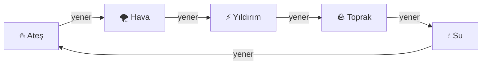

# Gölge Ninja — Element Dövüş Sistemi

Tasarım dökümanı · v1 · 2 Ağustos 2026

Bu döküman prototipin (v5.2) üstüne gelen çekirdek dövüş sisteminin tasarımıdır.
Kod yazılmadan önce kararların netleşmesi için hazırlandı.

---

## 1. Tasarım hedefi

Refleks ve okuma üstüne kurulu, **tekli düello** hissi veren bir el-jesti dövüş oyunu.
Oyuncu kamerayla el mührü yapar, rakibinin mührünü okur, doğru karşılığı yetiştirmeye
çalışır. Mermi yağmuru yok; her atış bir karar.

**Mevcut prototipten kalanlar:** render motoru, ninja modelleri (oyuncu + düşman),
arena ve siperler, oto-kilit kamera, MediaPipe el takibi altyapısı, düşmanın kol
kaldırma telegrafı.

**Kaldırılanlar:** kalkan (✋), tek tip ateş topu, 3 atışlık şarj sistemi, düşman spam'i.

---

## 2. Elementler ve avantaj döngüsü

Beş element, kapalı bir döngü. Her element **birini yener**, **birine yenilir**,
kalan **ikisine karşı nötrdür**.



| Element | Yener | Yenilir | Nötr |
|---|---|---|---|
| 🔥 Ateş | Hava | Su | Yıldırım, Toprak |
| 🌪 Hava | Yıldırım | Ateş | Toprak, Su |
| ⚡ Yıldırım | Toprak | Hava | Su, Ateş |
| 🪨 Toprak | Su | Yıldırım | Ateş, Hava |
| 💧 Su | Ateş | Toprak | Hava, Yıldırım |

Nötr eşleşmelerin varlığı bilinçli: her karşılaşma taş-kağıt-makasla bitmesin,
bazen ham güç ve ustalık belirlesin.

---

## 3. Mühür sistemi

### 3.1 Beş mühür

| Element | Mühür | El şekli |
|---|---|---|
| 🔥 Ateş | 👌 **Baş parmak + işaret** | Uçlar birleşik, diğer üç parmak açık |
| 🌪 Hava | 🖐 **Açık avuç** | Beş parmak açık ve ayrık, avuç kameraya dönük |
| 💧 Su | 🤟 **Üç parmak** | İşaret + orta + yüzük açık; serçe ve baş parmak kapalı |
| ⚡ Yıldırım | 🤙 **Baş parmak + serçe** | İkisi açık, diğer üç parmak kapalı |
| 🪨 Toprak | 🤘 **İşaret + serçe (rock)** | İkisi açık, orta ve yüzük kapalı |

Bu setin ayırt edici gücü şurada: mühürler **hangi parmakların açık olduğunda**
ayrışıyor — MediaPipe'ın en güvenilir okuduğu sinyal bu. Açıklık deseni (işaret,
orta, yüzük, serçe) olarak:

```
Hava     1 1 1 1        Su       1 1 1 0
Toprak   1 0 0 1        Yıldırım 0 0 0 1  (+ baş parmak açık)
Ateş     0 1 1 1        (+ baş–işaret teması)
```

Yalnız iki çift tek parmakla ayrılıyor — Hava/Su (serçe) ve Toprak/Yıldırım (işaret) —
ama ikisinde de **baş parmak konumu** ikinci bir bağımsız sinyal veriyor: Yıldırım'da
baş parmak yana açık, Toprak'ta avuçta kapalı.

### 3.2 Ölçülen dayanıklılık

Seçim tahminle değil ölçümle doğrulandı: her mühür sentetik el iskeletiyle üretildi,
MediaPipe hata modeli altında 2500 örnek/mühür sınıflandırıldı.

Hata modeli kritik: bağımsız gauss gürültü MediaPipe'ı temsil etmiyor. Gerçekte baş
parmağın **örttüğü** parmak ucu görünmez olur, ağ onu tahmin eder ve hata hem büyür
hem de parmağın kökü yönünde sistematik kayar. Ölçüm bu kapanma etkisiyle yapıldı.

| Landmark gürültüsü | Doğruluk | En zayıf çift |
|---|---|---|
| σ = %2.5 | %100.0 | — |
| σ = %4.5 | %100.0 | — |
| σ = %7.0 | %99.4 | Ateş ↔ Hava (%98.8) |
| σ = %10.0 | %96.0 | Ateş ↔ Hava (%93.8) |

**Tek zayıf nokta Ateş ↔ Hava.** Sebebi: Ateş'te işaret parmağı baş parmağa değmek
için bükülür ama diğer üçü açıktır; ağır gürültüde işaret "açık" okunursa el açık
avuca benzer. Panzehir zaten elde: baş parmak–işaret ucu mesafesi (temas sinyali)
bağımsız ve çok güçlü bir ayraç, sınıflandırıcıda ağırlığı yüksek tutulacak.

**"Üç parmak" hangi üçü?** İki okuma da ölçüldü:

| Okuma | σ=%7 | σ=%10 |
|---|---|---|
| İşaret + orta + yüzük | **%99.4** | **%96.0** |
| Orta + yüzük + serçe | %96.8 | %90.0 |

İşaret+orta+yüzük seçildi: hem daha doğal hem ölçümde belirgin biçimde daha sağlam
(ikinci okuma Ateş ile karışıyor, çünkü ikisinde de işaret parmağı kapalı görünüyor).

> **Uyarı:** Bu rakamlar sentetik iskelet üzerinden. Gerçek MediaPipe hatası bu modelin
> tam kopyası değil. Faz 1'de gerçek kamerayla doğrulanmadan Faz 2'ye geçilmeyecek.

### 3.3 Tanıma kuralları

- **Zaman kilidi:** mühür ~150 ms sabit tutulmadan onaylanmaz. `v5.2`'de kalkan için
  yazılan asimetrik sönümleme aynen kullanılır: tutarken tek kare kaybı mührü düşürmez.
- **Ayırt edici sinyaller:** dört parmağın uzama oranı (hangi parmaklar açık) +
  baş parmak–işaret ucu mesafesi (temas var mı) + baş parmak açıklığı (yana açık mı,
  avuçta mı). `v5.2`'deki `analyzeHand` metrikleri doğrudan yeniden kullanılabilir;
  açık avuç (Hava) zaten kalibre edilmiş durumda.
- **Belirsizlik reddi:** en yakın iki prototip arasındaki fark belli bir eşiğin
  altındaysa **hiçbir mühür tetiklenmez**. Yanlış element atmaktansa hiç atmamak
  daha iyi — kalkandaki asıl sorun buydu.
- **Geçiş karesi bağışıklığı:** bir mühürden diğerine geçerken aradaki şekiller
  zaman kilidini dolduramadığı için tetiklenmez.

### 3.4 Mühür dizisi, silah pozu ve ateşleme

Saldırı tek mühürle bitmiyor. Mühürler **arka arkaya** yapılır, dizinin tamamı hangi
beceriyi ürettiğini belirler. Değişmeyen tek şey dizinin **kapatıcısı**:

> 👉 **Silah pozu** — işaret + orta parmak açık, yüzük ve serçe kapalı, baş parmak dik.
> Bu poz görüldüğü an mühür seti **kapanır** ve el ateşlemeye hazır hale gelir.

**Akış**

1. **Diz** — element mühürleri sırayla yapılır (🔥 · 💧 · 🤘 …). Her mühür zaman
   kilidiyle onaylanır ve diziye yazılır.
2. **Kapat** — 👉 silah pozu diziyi kapatır.
3. **Eşleştir** — kapanan dizi beceri tablosunda aranır.
4. **Yüklen** — eşleşme varsa beceri yüklenir; el silah tutuşunda bekler, elde
   elementin rengiyle enerji toplanır (v5.2'deki şarj görselinin devamı).
5. **Ateşle** — silah tutuşundan tetikleme ile atış çıkar.

**Kurallar**

- **Eşleşme yoksa** beceri yüklenmez: dizi silinir ve kısa bir toparlanma gecikmesi
  (~0.4 sn) uygulanır. Rastgele mühür savurmak cezalandırılır.
- **Diziler arası zaman aşımı:** iki mühür arası **900 ms**'yi geçerse dizi sıfırlanır.
- **En kısa dizi tek mühürdür:** 🔥 → 👉 = o elementin temel saldırısı. Yeni başlayan
  oyuncu tek mühürle oynayabilir; uzun diziler bileşik ve güçlü becerileri açar.
- **Silah pozu nişan da alır.** İşaret parmağının yönü hedefi belirler — `v5.2`'de
  zaten böyle çalışıyor, korunacak.

**Ölçüm — silah pozu diğer beş mühürle karışıyor mu?**

Silah dizinin kapatıcısı olduğu için her dizinin sonunda geliyor; bir element
mühründen silaha geçiş sık ve hızlı. En riskli görünen geçiş 💧 Su → 👉 Silah, çünkü
aradaki tek fark yüzük parmağının kapanması. Ölçüldü:

| | σ=%2.5 | σ=%4.5 | σ=%7.0 |
|---|---|---|---|
| 6 sınıflı doğruluk | %100.0 | %100.0 | %99.0 |
| **Su ↔ Silah ayrımı** | **%100.0** | **%100.0** | **%100.0** |

Risk gerçekleşmedi: Su'da yüzük parmağı tam açık, silahta tam kapalı — bu marjinal
değil, güçlü bir fark. Silah pozunun eklenmesi setin genel doğruluğunu düşürmüyor.

**Baş parmak dik olmalı.** İki tutuş karşılaştırıldı; baş parmak dik (klasik tabanca)
olan, kapalı olandan daha iyi:

| Silah tutuşu | Toprak 🤘 doğruluğu (σ=%7) |
|---|---|
| Baş parmak **dik** 👉 | %99.8 |
| Baş parmak kapalı | %98.3 |

Baş parmak kapalı olduğunda silah, Toprak (işaret+serçe) ile karışmaya başlıyor —
ikisi de baş parmağı avuçta tutan, iki parmağı açık pozlar haline geliyor.

### 3.5 Savunma: karşı elementin mührü

Savunma için ayrı bir mühür alfabesi **yok**. Gelen saldırıya karşı, onu yenen
elementin mührünü yaparsın:

| Gelen saldırı | Yapman gereken mühür |
|---|---|
| 🔥 Ateş | 💧 Su — 🤟 üç parmak |
| 🌪 Hava | 🔥 Ateş — 👌 baş parmak + işaret |
| ⚡ Yıldırım | 🌪 Hava — 🖐 açık avuç |
| 🪨 Toprak | ⚡ Yıldırım — 🤙 baş parmak + serçe |
| 💧 Su | 🪨 Toprak — 🤘 işaret + serçe |

Bu seçimin büyük avantajı: tanınması gereken jest sayısı **10 değil 5**. Aynı mühür
bağlama göre saldırı ya da savunma okunur — havada sana gelen bir mermi varsa savunma,
yoksa saldırı.

**Savunmada silah pozu YOK.** Saldırı `diz → 👉 kapat → yüklen → ateşle` akışını
izler; savunma ise tek mührün tanınmasıyla **anında** tetiklenir. Sebep tempo:
düşmanın telegrafı ~1.1 sn ve savunma mührünü yapmak zaten bunun çoğunu yiyor —
üstüne bir de silah pozu istemek savunmayı yetişilmez kılar. Bu ayrım aynı zamanda
iki modu birbirinden temiz ayırıyor: **saldırı kasıtlı ve dizili, savunma refleks.**

### 3.6 Tek elementli oyuncu sorunu ve çözümü

**Gerilim:** Oyuncu tek elementle başlıyor. Savunma karşı elementin mührünü
gerektiriyorsa, tek elementli oyuncu yalnızca **bir** element türüne karşı
savunabilir — diğer dördüne karşı çaresiz kalır.

**Çözüm — savunma serbest, saldırı ustalığa bağlı:**

- **Savunma mührü ilk andan itibaren beş element için de yapılabilir.** Savunmada mühür
  hasar vermez, yalnızca gelen saldırıyı karşılar; bu yüzden "ustalık" şartı aranmaz.
- **Saldırı yalnızca ustalaşılmış elementlerle yapılabilir.** İlerleme burada:
  saldırı çeşitliliği ve gücü açılır.
- Ustalaşılmamış bir elementle yapılan savunma **zayıftır**: yalnızca merminin
  yeterince erken karşılanması hâlinde nötrler, geç kalınırsa sıyırma hasarı geçer.
  Ustalaşılmış elementle savunma hem daha geniş zaman penceresine sahiptir hem de
  karşı-itme (rakibi geri savurma) yapar.
- **Siper her zaman geçerli.** Mühür yetiştiremediğin an arena objelerinin arkasına
  girmek en garanti savunmadır — tasarımın açık kaçış valfi budur.

Böylece tek elementli oyuncu hayatta kalabilir, ilerleme hâlâ anlamlıdır, ve
"refleks arttıkça çoklu element" hedefi korunur.

### 3.7 Beceri tablosu — ilk taslak

**Tasarım ilkesi: ezber değil türetme.** İki mühürlük 25 kombinasyonu tek tek
ezberletmek yerine, beceriler **döngüdeki ilişkiden** türetiliyor. Oyuncu tabloyu
değil üç kuralı öğreniyor:

> **Aynı element ×2** → güçlendirilmiş hâli
> **Yendiğin elementi ekle** → beslenmiş: hızlı ve delici
> **Seni yenen elementi ekle** → füzyon: hasar değil **kontrol**

#### Kademe 1 — Temel saldırılar (1 mühür)

Elementler burada birbirinden ayrışıyor; fark yalnızca avantaj döngüsünde değil.

| Dizi | Beceri | Hız | Hasar | Delme | Not |
|---|---|---|---|---|---|
| 🔥 👉 | **Alev Oku** | orta | orta | orta | dengeli |
| 🌪 👉 | **Rüzgar Bıçağı** | çok hızlı | düşük | düşük | taciz, kesme |
| 💧 👉 | **Su Kırbacı** | orta | orta | düşük | hafif hedef takibi |
| ⚡ 👉 | **Şimşek Ucu** | anlık | düşük | yüksek | kaçması çok zor |
| 🪨 👉 | **Taş Mermisi** | yavaş | yüksek | çok yüksek | görülür ama durdurulamaz |

#### Kademe 2A — Güçlendirilmiş (aynı element ×2)

| Dizi | Beceri | Etki |
|---|---|---|
| 🔥🔥 👉 | **Ejder Nefesi** | geniş koni, kısa menzil, çok yüksek hasar |
| 🌪🌪 👉 | **Kasırga** | iter — düşmanı siperin arkasından söker çıkarır |
| 💧💧 👉 | **Sel Dalgası** | geniş cephe, isabet edeni yavaşlatır |
| ⚡⚡ 👉 | **Gök Mızrağı** | anlık, en yüksek delme değeri |
| 🪨🪨 👉 | **Taş Duvar** | *saldırı değil:* önüne geçici siper diker |

**Taş Duvar** tasarımın çekirdeğine bağlanıyor: en garanti savunma siper ise, kendi
siperini dikebilmek toprak ustasının imzası olur.

#### Kademe 2B — Beslenmiş (yendiğin elementi ekle)

İkinci element birinciyi besler. En hızlı yüklenen ve en delici kademe.

| Dizi | Beceri | Etki |
|---|---|---|
| 🔥→🌪 👉 | **Alev Fırtınası** | hava ateşi körükler: hızlı + yüksek delme |
| 🌪→⚡ 👉 | **Fırtına Sarmalı** | geniş, iter ve sersemletir |
| ⚡→🪨 👉 | **Şarapnel Yıldırımı** | çarpınca parçalanır, çoklu isabet |
| 🪨→💧 👉 | **Taş Seli** | yavaş ama neredeyse durdurulamaz |
| 💧→🔥 👉 | **Kaynar Dalga** | isabet sonrası yanma hasarı bırakır |

#### Kademe 2C — Füzyon (seni yenen elementi ekle)

Zıt elementi katmak dengesiz bir karışım üretir: ham hasar yerine **kontrol**.

| Dizi | Beceri | Etki |
|---|---|---|
| 🔥→💧 👉 | **Buhar Perdesi** | görüşü kapatır, düşmanın nişanını bozar |
| 🌪→🔥 👉 | **Kor Girdabı** | alan hasarı, bölgeyi bir süre kapatır |
| ⚡→🌪 👉 | **İyon Alanı** | yavaşlatır, düşmanın mühür süresini uzatır |
| 🪨→⚡ 👉 | **Sarsıntı** | sersemletir ve **siperleri yıkar** |
| 💧→🪨 👉 | **Bataklık** | zemini yavaşlatır, kaçışı keser |

#### Kademe 3 — Zincirleme üstünlük (3 mühür)

Döngüde **ardışık üç element** — yani her biri bir sonrakini yenen zincir. Beş zincir,
beş nihai beceri. Kural yine türetilebilir: *"yendiğin elementi, sonra onun yendiğini."*

| Dizi | Zincir | Beceri |
|---|---|---|
| 🔥🌪⚡ 👉 | Ateş > Hava > Yıldırım | **Yanan Gökyüzü** |
| 🌪⚡🪨 👉 | Hava > Yıldırım > Toprak | **Fırtına Kıyameti** |
| ⚡🪨💧 👉 | Yıldırım > Toprak > Su | **Yeraltı Sarsıntısı** |
| 🪨💧🔥 👉 | Toprak > Su > Ateş | **Volkan** |
| 💧🔥🌪 👉 | Su > Ateş > Hava | **Buhar Kasırgası** |

Nihai beceriler çok yüksek güç ve delme taşır ama uzun yüklenir — dövüşün ortasında
açıkta denenmez. **Siper arkasına geçip yüklemek** doğru kullanımdır; bu da siperi
yalnızca savunma değil, saldırı hazırlığı aracı yapar.

#### Yükleme süresi ve risk dengesi

| Dizi uzunluğu | Yükleme | Risk |
|---|---|---|
| 1 mühür | ~0.35 sn | güvenli, dövüşün ortasında yapılabilir |
| 2 mühür | ~0.70 sn | orta — açık alanda risklidir |
| 3 mühür | ~1.20 sn | siper gerektirir |

Düşman telegrafı ~1.1 sn olduğu için 3 mühürlük dizi açıkta neredeyse her zaman
cezalandırılır. Tempo böylece kendini dengeliyor.

#### Açılma sırası

Beceri yalnızca dizideki **tüm elementlerde ustalık varsa** yüklenir. Bu, ilerlemeyi
kendiliğinden kademelendiriyor:

1. Tek element seçilir → Kademe 1 ve o elementin Kademe 2A becerisi açıktır
2. İkinci element açılır → o ikilinin 2B / 2C becerileri gelir
3. Üçüncü element açılır → ilgili Kademe 3 zinciri açılır

#### Rezerve: nötr çiftler

Döngüde birbirini yenmeyen 10 ikili (🔥+⚡, 🌪+💧 gibi) bu taslakta boş bırakıldı.
İleride hareket, tuzak ve destek becerileri için ayrıldı — tablo ilk sürümde
öğrenilebilir kalsın diye.

---

## 4. Saldırı, güç ve havada çarpışma

### 4.1 Mermi özellikleri

Her mermi şunları taşır:

| Alan | Anlamı |
|---|---|
| `element` | Beş elementten biri |
| `guc` | Etkin güç = ustalık seviyesi + mühür kalitesi |
| `sahip` | Atan taraf (oyuncu / düşman kimliği) |

**Mühür kalitesi:** dizinin ne kadar temiz ve hızlı yapıldığı. Poz onayları
gecikmeli ya da sınırda geçtiyse kalite düşer. Aynı ustalıkta iki oyuncudan mührü
daha temiz yapan üstün gelir — mekanik böylece "kim daha iyi mühür yapıyor"a bağlanır.

### 4.2 Çarpışma çözümü

İki mermi havada karşılaştığında:

1. **Element ilişkisine göre etkin güç hesaplanır**
   - A, B'yi yeniyorsa: `farkA = gucA * AVANTAJ - gucB`   (`AVANTAJ` ≈ 1.6)
   - Nötr eşleşme: `farkA = gucA - gucB`
   - **Aynı element:** `farkA = gucA - gucB` — yani doğrudan ustalık ve mühür kalitesi
     karşılaşır. *"Aynı tür elementler çarpıştığında güçlü olan mühür diğerini deler."*

2. **Sonuç eşiğe göre belirlenir**

| Durum | Sonuç |
|---|---|
| `|fark|` küçük (< `NOTR_ESIK`) | **Nötrleşme** — iki mermi de yok olur, çarpışma patlaması |
| `fark` büyük | **Delip geçme** — kazanan mermi gücü azalarak yoluna devam eder ve kaybedenin sahibine **otomatik kilitlenir** |

Delip geçen mermi hedefe kilitlendiği için kaçınmanın tek yolu **sipere girmektir** —
bu da "en garanti savunma objelerin arkası" ilkesini mekanik olarak zorunlu kılar.

### 4.3 Savunma mührü çarpışması

Savunma mührü, kendi elementinde ve savunanın gücüyle bir **karşılama mermisi** üretir;
sonra yukarıdaki aynı kurallar işler. Yani savunma ayrı bir sistem değil, saldırının
özel hâli. Tek fark: savunma mermisi menzil olarak kısadır ve savunanın önünde oluşur.

---

## 5. Ustalık ve ilerleme

- Her element için ayrı **ustalık seviyesi** (0–5).
- Oyuna başlarken oyuncu **bir element seçer**, o element seviye 1'de başlar.
- Ustalık artışı: o elementle isabet, başarılı savunma, ve temiz mühür kalitesi.
- Yeni element açılışı: belli bir toplam ustalık + refleks eşiği (ortalama tepki süresi)
  aşıldığında bir sonraki element saldırıya açılır.
- Ustalık etkisi: mermi gücü, mühür onay penceresi genişliği, savunma zaman penceresi.

---

## 6. Dövüş döngüsü ve tempo

- **Can:** hem oyuncu hem düşman can barına sahip. Tek isabet öldürmez; düello birkaç
  doğru okuma sürer.
- **Aynı anda en fazla 3 düşman** (PvE). Spam yok, sürekli yaylım ateşi yok.
- **Telegraf:** düşman mührünü yapmadan önce kolunu kaldırır ve elinde element rengiyle
  enerji toplar — `v5.2`'de bu telegraf zaten uygulandı, element rengi ona bağlanacak.
- **Tepki penceresi** en kritik ayar: telegraf süresi, oyuncunun iki pozluk mührü
  yetiştirmesine yetmeli.
  - Kolay: ~1.5 sn · Orta: ~1.1 sn · Zor: ~0.8 sn
- **Yanlış mühür cezası:** hasar değil, kısa bir toparlanma gecikmesi (~0.4 sn).
  Panikleyip rastgele mühür yapmak cezalandırılır ama oyunu bitirmez.
- **Takip hissi:** düşmanlar siperler arasında konum değiştirir, görüş hattı kesilince
  yaklaşır. Sürekli ateş etmez; fırsat kollar.

---

## 7. PvE düşman davranışı

| Tip | Element eğilimi | Davranış |
|---|---|---|
| Hayalet (mevcut) | Nötr / tek element | Süzülür, mesafe korur, uzaktan atar |
| Ninja (v5.2) | Sabit bir element | Yerde koşar, yakından taciz eder, siper kullanır |
| *(sonra)* Usta | İki element | Element değiştirerek okumayı zorlaştırır |

Düşman element seçimi görünür olmalı: paleti elementinin rengini taşır
(🔥 kızıl, 💧 mavi, 🪨 toprak sarısı, 🌪 açık yeşil, ⚡ mor-beyaz).
Böylece oyuncu daha çarpışma başlamadan hangi savunmaya hazırlanacağını bilir.

---

## 8. PvP 1v1

Sonraki faz. Yukarıdaki çarpışma çözümü **deterministik** olduğu için lockstep
senkronizasyon uygulanabilir: iki taraf yalnızca onaylanmış mühür olaylarını
(element + kalite + zaman damgası) gönderir, simülasyon her iki tarafta aynı sonucu üretir.

Karar bekleyen konu: taşıma katmanı — WebRTC DataChannel (eşler arası, düşük gecikme)
ya da WebSocket röle (kurulumu kolay, sunucu gerekir).

---

## 9. Uygulama fazları

| Faz | İçerik | Çıktı |
|---|---|---|
| **1** | Mühür tanıma katmanı: 5 mühür + zaman kilidi + belirsizlik reddi | Sentetik iskelet testleri + ekranda canlı mühür test alanı |
| **2** | Element çekirdeği: mermi, güç, havada çarpışma, delme/nötrleme, siper | Tek düşmanla oynanabilir düello |
| **3** | PvE: 1–3 düşman, davranış, can, ustalık ve ilerleme | Tam oynanabilir tek kişilik oyun |
| **4** | PvP 1v1: taşıma katmanı + lockstep | İki kişilik düello |

Faz 1 kritik: her şey mühür tanımanın güvenilirliğine bağlı ve geçen sefer kırılan
yer tam olarak burasıydı. Sentetik iskeletlerle kalibrasyon + gerçek kamerayla senin
onayın alınmadan Faz 2'ye geçilmeyecek.

---

## 10. Netleşmesi gereken konular

Bunlar Faz 1'i bloke etmiyor, Faz 2'den önce karara bağlanmalı:

1. **Can değerleri:** kaç isabet öldürür? Doğru okumayla kaç saniyelik düello hedefleniyor?
2. **Nişan:** oto-kilit mi kalsın, yoksa oyuncu silah pozuyla hedefi kendi mi seçsin?
3. **Ses:** her elementin ayırt edici sesi olacak mı? (Telegrafın duyulabilir olması
   refleks penceresini ciddi biçimde genişletir.)
4. **Yüklü beceri taşınabilir mi?** Beceri yüklendikten sonra ateşlemeden dolaşılabilir
   mi, yoksa belli bir süre sonra söner mi? Taşınabilirse siper arkasında yükleyip
   çıkmak temel taktik olur — muhtemelen istenen bu, ama süresi belirlenmeli.

**Kapanan konular** (3.7'deki beceri tablosuyla karara bağlandı):

- ~~Şarj var mı?~~ → Şarj yerine **yükleme**: dizi kapanınca beceri yüklenir, süresi
  dizi uzunluğuyla artar (0.35 / 0.70 / 1.20 sn). Ayrı bir basılı tutma mekaniği yok.
- ~~Elementler farklı davranıyor mu?~~ → **Evet.** Yıldırım anlık ve delici ama zayıf,
  Toprak yavaş ama durdurulamaz, Hava hızlı ve taciz edici, Su takipli, Ateş dengeli.
